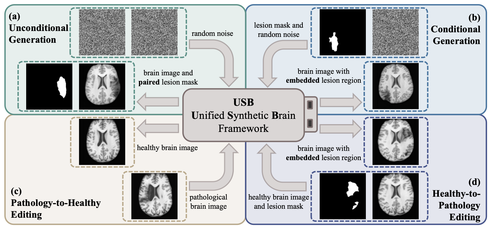

## <p align="center">USB: Unified Synthetic Brain Framework for Bidirectional Pathology–Healthy Generation and Editing</p>

**<p align="center">Jun Wang<sup>1</sup>, Peirong Liu<sup>1</sup></p>**

<p align="center">
<sup>1</sup>Johns Hopkins University
</p>

<p align="center">
  
</p>


## Downloads
Please download USB's weights ('./checkpoints/usb_lesion.pth', './assets/checkpoints/usb_brain.pth') and testing images ('./test_samples') in this [Google Drive folder](https://drive.google.com/drive/folders/1tv-lCrPOzmyMmQkeuKHsIhfsxOAqUqFm?usp=drive_link), then move them into the './assets' folder in this repository. We also provided original images for generating these paired testing samples in './data'.


## Environment
Training and evaluation environment: Python 3.11.4, PyTorch 2.0.1, CUDA 12.2. Run the following command to install required packages.
```
conda create -n USB python=3.11
conda activate USB

cd /path/to/usb
pip install -r requirements.txt
```

## Demo

### Fluid-Driven Anatomy Randomization Generator

```
cd /path/to/usb

python scripts/demo_create_dataset.py \
    --data_config_path cfgs/dataset/test/create_test.yaml \
    --save_path assets
```

Generation and Editing

```
cd /path/to/usb
```
Unconditional generation:
```
python scripts/demo_test.py \
    --mode uncond_gen \
    --config_path cfgs/trainer/test/demo_test.yaml
```

Conditional generation:
```   
python scripts/demo_test.py \
    --mode cond_gen \
    --config_path cfgs/trainer/test/demo_test.yaml
```

Pathology-to-healthy editing:
```  
python scripts/demo_test.py \
    --mode p2h_edit \
    --config_path cfgs/trainer/test/demo_test.yaml
```

Healthy-to-pathology editing:
```
python scripts/demo_test.py \
    --mode h2p_edit \
    --config_path cfgs/trainer/test/demo_test.yaml
```

## Create Dataset

```
cd /path/to/usb
```

First compute the new affine matrices for raw MRI volumes. Take HCP dataset as example:
```
python scripts/mni_mapping.py \
    --input_path assets/data/hcp/T1 \
    --label_path assets/data/hcp/label_maps_segmentation \
    --new_affine_path assets/data/hcp/T1_affine \
    --workers 8
```

Then create the dataset for paired lesion-pathology data:
```
python scripts/demo_create_dataset.py \
    --data_config_path cfgs/dataset/test/create_train.yaml \
    --save_path assets
```

## Training on Synthetic Data

```
cd /path/to/usb
```

First train $USB_{lesion}$:
```
python scripts/train.py \
    --mode lesion \
    --config_path cfgs/trainer/train/train.yaml \
    --data_file experiment_data/train_healthy.txt
```

Then use the pretrained $USB_{lesion}$ to train $USB_{brain}$:
```
python scripts/train.py \
    --mode brain \
    --config_path cfgs/trainer/train/train.yaml \
    --data_file experiment_data/train_healthy.txt \
    --model_lesion_path assets/checkpoints/usb_lesion.pth

```

## Testing 
```
cd /path/to/una
python scripts/test.py
```

## Download the Public Datasets

- ADHD200 dataset: Request data from [official website](https://fcon_1000.projects.nitrc.org/indi/adhd200/).

- HCP dataset: Request data from [official website](https://www.humanconnectome.org/study/hcp-young-adult/data-releases).

- OASIS3 dataset Request data from [official website](https://www.oasis-brains.org/#data).

- ATLAS dataset: Request data from [official website](https://fcon_1000.projects.nitrc.org/indi/retro/atlas.html). 

- ISLES2022 dataset: Request data from [official website](https://www.isles-challenge.org/).

- ADNI datasets: Request data from [official website](https://adni.loni.usc.edu/data-samples/access-data/).

- Segmentation labels for data simulation: To train UNA model of your own from scratch, one needs the segmentation labels for synthetic image simulation. We obtained the brain anatomy labels via three steps:
     (1) Skull-strip: [SynthStrip toolbox](https://surfer.nmr.mgh.harvard.edu/docs/synthstrip/); 
     (2) Synthesize T1w: [SynthSR toolbox](https://surfer.nmr.mgh.harvard.edu/fswiki/SynthSR); 
     (3) Obtain anatomy segmentation labels: [SynthSeg toolbox](https://surfer.nmr.mgh.harvard.edu/fswiki/SynthSeg).


## Dataset Structure
Data structure of the raw inputs used to generate paired lesion–pathology samples:

```
/path/to/dataset/
  T1/
    subject_name.nii.gz
    ...
  T1_affine/
    subject_name.affine.npy
    ...
  label_maps_segmentation/
    subject_name.nii.gz
    ...
  pathology_probability/ # for pathological data
    subject_name.nii.gz
    ...
```

Data structure for training and testing:
```
/path/to/dataset/
  training_samples/
    subject_name_healthy.nii
    subject_name_mask.nii
    subject_name_pathology.nii
    ...
  test_samples/
    subject_name_healthy.nii
    subject_name_mask.nii
    subject_name_pathology.nii
    ...
  train_healthy.txt
  train_mask.txt
  train_pathology.txt
  test_healthy.txt
  test_mask.txt
  test_pathology.txt
```


## Citation
TODO

